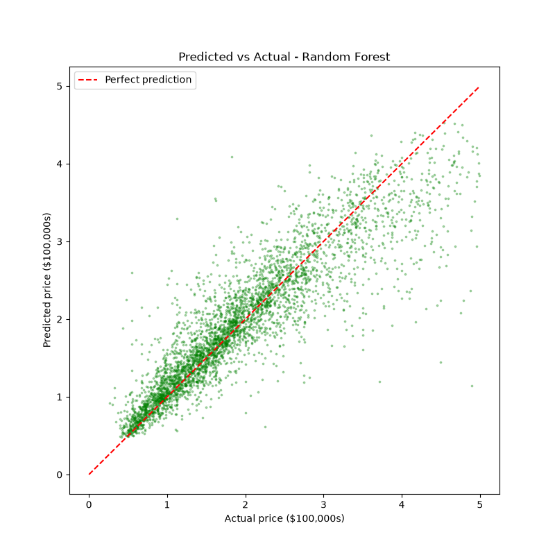
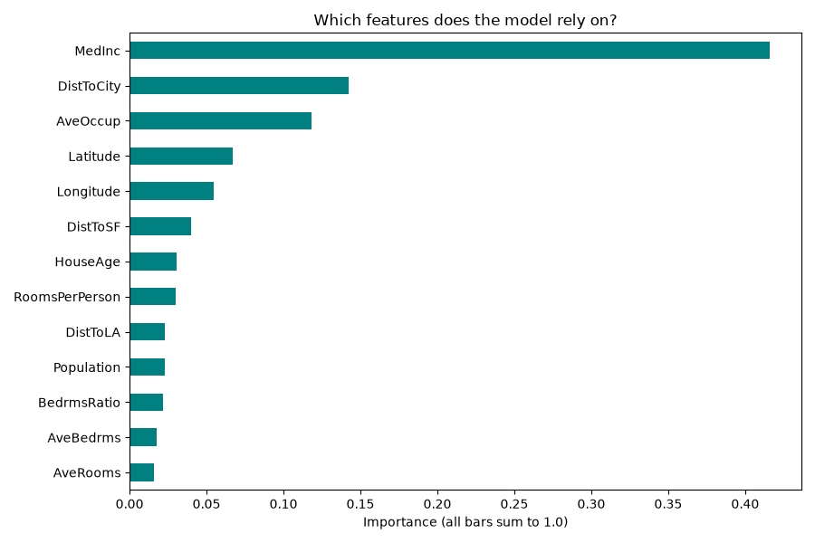
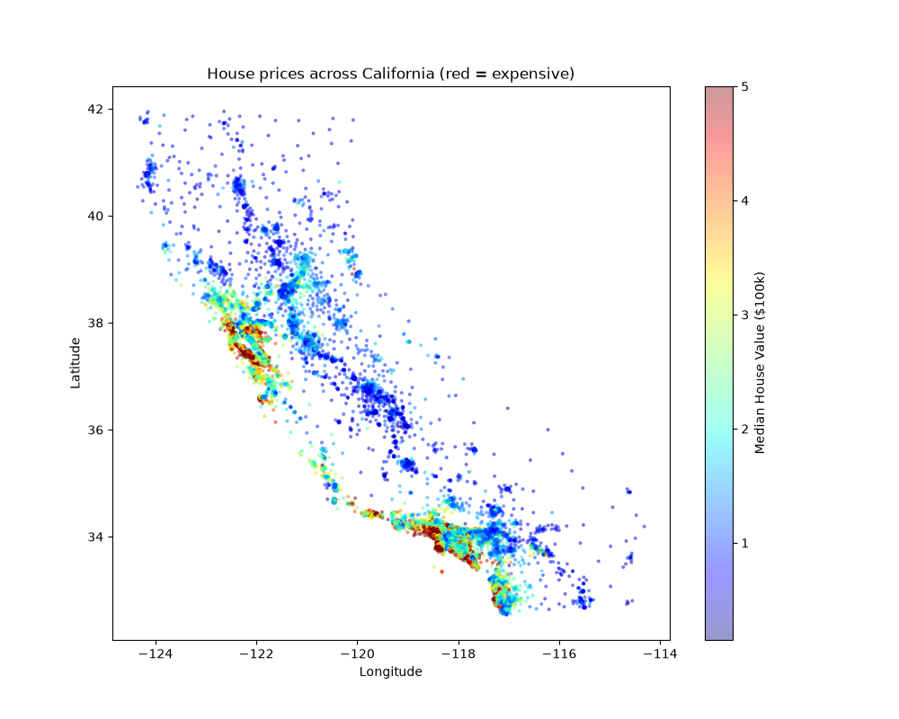

# 🏠 California House Price Predictor

An end-to-end machine learning pipeline that predicts median house prices for California districts — from raw data to a deployed interactive web app.

**Best model: Random Forest · R² = 0.805 · Typical error ≈ $29,000**

## 🎯 Highlights

- Full ML workflow: data acquisition → EDA → cleaning → feature engineering → model comparison → evaluation → deployment
- **Feature engineering win:** an engineered `DistToCity` feature (distance to the nearest big city, built from raw latitude/longitude) became the **2nd most important feature** in the final model — beating every original column except income
- Compared 4 models (Linear Regression → Gradient Boosting) and demonstrated overfitting live: a single Decision Tree scored *worse* than Linear Regression, while the Random Forest ensemble won
- Deployed as an interactive **Streamlit** app with sliders, city presets, and a live map

## 📊 Results

| Model | R² | RMSE | Avg Error |
|-------|-----|------|-----------|
| Linear Regression | 0.654 | 0.584 | $42,825 |
| Decision Tree | 0.620 | 0.612 | $40,013 |
| **Random Forest** 🏆 | **0.805** | **0.438** | **$28,691** |
| Gradient Boosting | 0.792 | 0.452 | $31,107 |

### Predicted vs Actual


### Feature Importance — engineered `DistToCity` ranks #2


### House prices across California


## 🗂️ Project Structure

```
house-price-predictor/
├── data/                    # datasets (generated by scripts, gitignored)
├── notebooks/plots/         # EDA & evaluation plots
├── src/
│   ├── get_data.py          # 1. download California Housing dataset
│   ├── explore_data.py      # 2. EDA: stats, histograms, map, correlations
│   ├── clean_data.py        # 3. remove capped prices & outliers
│   ├── engineer_features.py # 4. ratio + distance-to-city features
│   ├── train.py             # 5+6. split 80/20, train & compare 4 models
│   └── evaluate_and_save.py # 7+8. deep evaluation, save best model
├── models/                  # trained model (gitignored, 140MB)
├── app.py                   # 9. Streamlit web app
└── requirements.txt
```

## 🚀 Run It Yourself

```bash
# 1. Install dependencies
pip install -r requirements.txt

# 2. Rebuild the pipeline (data + model, ~1 minute total)
python src/get_data.py
python src/clean_data.py
python src/engineer_features.py
python src/train.py
python src/evaluate_and_save.py

# 3. Launch the web app
streamlit run app.py
```

Then open http://localhost:8501 — move the sliders, switch city presets (San Francisco vs Fresno!), and watch the prediction update live.

## 🧠 Key Decisions

- **Removed 992 capped rows**: prices were clipped at $500k in the source data; keeping them teaches the model to never predict above the cap
- **Removed 162 outlier districts**: e.g. "households" with 141 rooms or 1,243 occupants (dorms/prisons/data errors)
- **Raw data never touched**: each pipeline stage writes a new CSV (`raw → clean → features`), so any decision can be revisited
- **Train/test split before any training**: the Decision Tree's failure (R² 0.620 vs 0.805 for the forest) is only visible because evaluation uses unseen data

## 📚 Dataset

[California Housing](https://scikit-learn.org/stable/datasets/real_world.html#california-housing-dataset) (1990 US census, 20,640 districts) via scikit-learn. Each row is one district; the target is the median house value.
